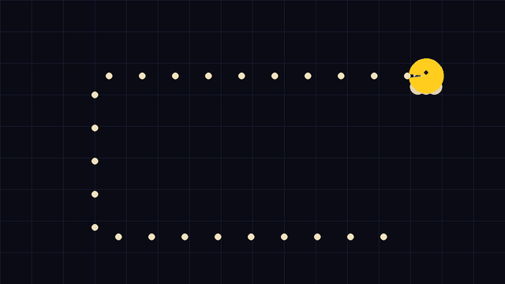

<div align="center">


# U_LOG · 유로그

### 편리한 일상 기록 & 감정 인지 서비스

> *"아무 일 없는 보통의 하루"* 를 채집하고 세공하는 게임화 아카이빙 서비스
>
> 매일의 기록을 부담 없이 남기고, 그 안의 **감정을 인지·시각화**해 나를 돌아보게 합니다.

<br/>


**테크포임팩트 캠퍼스 · 2026 상반기 · 닥토팀**

</div>

---

## 🌿 무엇을 하나요

U_LOG는 거창한 일이 없어도 괜찮은, **평범한 하루를 위한 기록 서비스**입니다.

- **편리한 일상 기록** — 짧은 한 줄, 사진 한 장이면 충분. 기록의 진입장벽을 최소화했습니다.
- **감정 인지** — 기록 속 감정을 AI가 읽어 10종 감정 코드로 분류하고, 흐름을 시각화합니다.
- **게임화 아카이빙** — 하루의 조각을 *수집품(gem)* 처럼 모으고 세공하며, 다시 보고 싶은 아카이브로 만듭니다.

<div align="center">

</div>

---

## 🧩 아키텍처

```
┌──────────┐          ┌──────────┐          ┌──────────┐
│ frontend │ ← HTTP → │ backend  │ ← Queue →│ ai/agent │
│  (PWA)   │ ← SSE ── │  (API)   │          │ (worker) │
└──────────┘          └────┬─────┘          └──────────┘
                           │ HTTP (내부)
                           ▼
                      ┌──────────┐
                      │ ai/rembg │  배경 제거(누끼)
                      │ (python) │
                      └──────────┘
```

| 파트 | 경로 | 스택 |
|---|---|---|
| **프론트엔드** | [`frontend/`](frontend/) | Vite + React 19 + TS + Tailwind v4 + PWA |
| **백엔드** | [`backend/`](backend/) | Node 22 + Fastify + Drizzle + Postgres + Redis |
| **AI · 에이전트** | [`ai/agent/`](ai/agent/) | TS + BullMQ 워커, GPT-4.1 mini / Gemini 2.5 Flash |
| **AI · 누끼** | [`ai/rembg/`](ai/rembg/) | Python 3.11 + FastAPI + rembg |
| **디자인** | [`design/`](design/) | Figma, 커스텀 픽셀 스프라이트, 마스코트 *로기* |
| **운영** | [`ops/`](ops/) | 운영 콘솔(웹), 시드·동기화 스크립트 |

> 각 폴더는 독립 개발 가능합니다 (공통 의존성 없음). 공유 계약은 감정 코드 10종 slug(`backend/src/db/seeds/emotions.ts`)와 백엔드 Zod 스키마 타입입니다.

---

## 🚀 시작하기

```bash
# 0. 요구사항: Node 22+, Python 3.11+, Docker(Postgres + Redis)

# 1. 환경변수 — 각 파트 루트에서
cp frontend/.env.example frontend/.env.local
cp backend/.env.example  backend/.env
# ai/agent, ai/rembg 등도 각 .env.example 참고

# 2. 프론트엔드
cd frontend && npm install && npm run dev

# 3. 백엔드
cd backend && npm install && npm run dev
```

각 파트의 상세 실행법과 개발 일정은 [`DEVELOPMENT.md`](DEVELOPMENT.md) 를 참고하세요.

---

## 📂 폴더 구조

```
U_LOG/
├── frontend/    # PWA 클라이언트
├── backend/     # API 서버
├── ai/          # agent(워커) · rembg(누끼) · chatbot
├── design/      # 디자인 산출물 · 마스코트 애니메이션
├── ops/         # 운영 콘솔 · 스크립트
├── structure/   # 설계 문서
└── worklogs/    # 개발 로그
```

---

<div align="center">

**U_LOG (유로그)** — 보통의 하루를, 기억할 만한 하루로.

<sub>테크포임팩트 캠퍼스 2026 상반기 · 닥토팀</sub>

</div>
